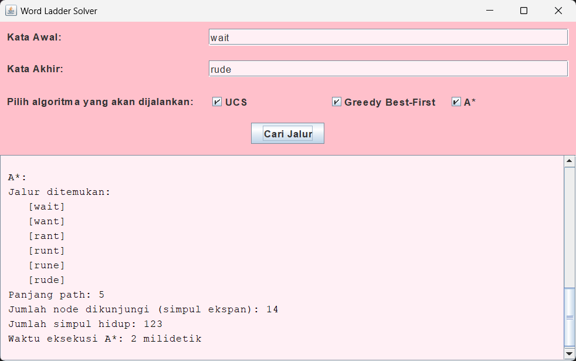

# Word Ladder Solution
> Word Ladder adalah permainan kata yang ditemukan oleh Lewis Carroll, seorang penulis dan matematikawan, pada tahun 1877. Pada permainan ini, pemain diberikan dua kata yang disebut sebagai start word dan end word. Untuk memenangkan permainan, pemain harus menemukan rantai kata yang dapat menghubungkan antara start word dan end word yang banyaknya huruf selalu sama. Tiap kata yang berdekatan dalam rantai kata tersebut hanya boleh berbeda satu huruf saja. Pada permainan ini, diharapkan solusi optimal, yaitu solusi yang meminimalkan banyaknya kata yang dimasukkan pada rantai kata.

## Table of Contens
* [General Info](#general-information)
* [Technologies Used](#technologies-used)
* [Features](#features)
* [Setup](#setup)
* [Usage](#usage)
* [Acknowledgements](#acknowledgements)
* [Author](#author)

## General Information
- Untuk mendapatkan solusi optimal dalam permainan Word Ladder, dilakukan pembangunan algoritma Uniform Cost Search (UCS), Greedy Best First Search (GBFS), dan A* sebagai algoritma pencarian rute atau route planning. Ketiga algoritma tersebut dibuat untuk membandingkan keoptimalan solusi, memori, dan waktu yang dibutuhkan. 

## Technologies Used
- java version "20.0.2"

## Features
- User dapat memasukkan kata awal dan kata tujuan dalam lower case seluruhnya
- User dapat memilih metode algoritma apa saja yang akan dijalankan
- User dapat memulai pencarian denga memencet tombol "cari jalur"
- User dapat melihat hasil pencarian berdasarkan metode algoritma yang dipilih

## Screenshots

## Setup
- Unduh dan install Java Development Kit (JDK) melalui situs resmi Oracle atau situs distribusi Java lainnya sesuai dengan sistem operasi Anda (Windows, macOS, atau Linux). Ikuti petunjuk instalasi yang disediakan.
- Setelah instalasi, Anda mungkin perlu menambahkan jalur instalasi JDK ke variabel lingkungan PATH. Panduan untuk melakukan ini berbeda tergantung pada sistem operasi Anda. 

## Usage
- Masuk ke dalam direktori "src"
- Buka terminal 
- Ketik `make run` untuk menjalankan program hingga muncul GUI program
- Ketik `make class` untuk membersihkan file .class jika sudah tidak ingin menggunakan program

## Acknowledgements
- Project ini dibuat berdasarkan spesifikasi yang terdapat pada (https://informatika.stei.itb.ac.id/~rinaldi.munir/Stmik/2023-2024/Tucil3-2024.pdf)

## Author
- Diana Tri Handayani | 13522104
